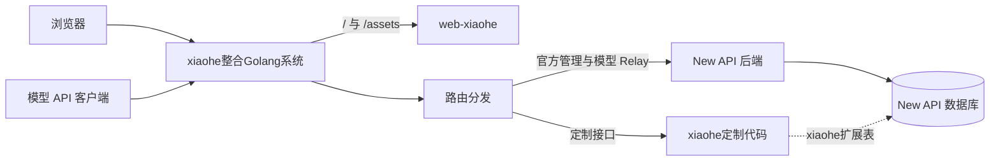
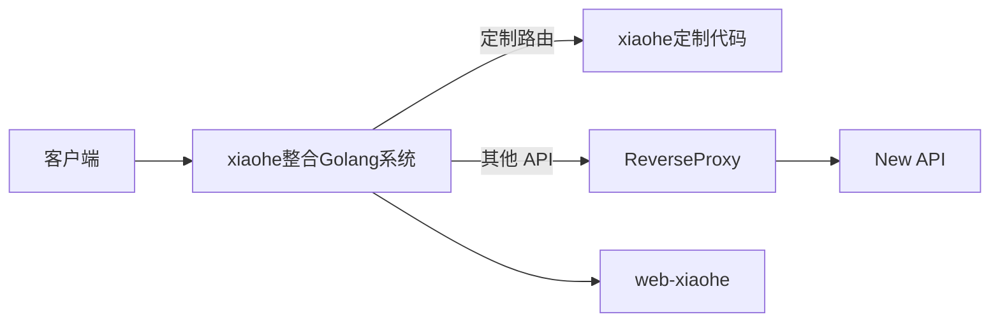

# New API 整合系统设计

## 1. 概要

### 1.1 建设目标

xiaohe整合系统定位为统一访问入口，对外承接页面和 API 请求，再按路由转发到 New API 官方能力或 xiaohe定制代码。`web-xiaohe` 负责定制页面，New API 继续提供用户、渠道、Token、计费、日志、任务和模型转发等核心能力。

总体方向是分阶段建设：前期不改数据库，以页面接管、内置接口和透明代理为主完成首版；后期根据已确认的定制业务，再按需增加 `xiaohe_*` 扩展表，但不修改或复制 New API 官方表。

设计重点如下：

1. 由 xiaohe 守住统一入口，对外路径保持稳定，后端可按需指向 New API 或定制代码。
2. 保持 New API 为官方领域数据的唯一事实源，避免重复实现现有能力。
3. xiaohe 服务实例保持无状态，可直接横向扩容；持久化状态统一存入共享数据库。
4. 前期以无状态反向代理和页面接管为主，后期再按实际需求扩建 `xiaohe_*` 定制表。
5. 隔离官方管理 API、xiaohe定制 API 和模型转发 API，降低官方升级冲突。
6. New API 接口仅开放在内部网络，浏览器和模型客户端必须通过 xiaohe整合Golang系统访问，不得直接连接 New API。

### 1.2 设计原则

- **统一入口**：客户端只访问 xiaohe整合Golang系统，New API 仅在内部网络提供服务。
- **路由分工**：New API 已有能力直接代理到 New API，xiaohe 定制能力由整合系统内置代码处理。
- **数据隔离**：官方数据由 New API 维护；xiaohe 数据按需持久化，并使用独立的 `xiaohe_*` 表。
- **接口隔离**：官方管理 API、xiaohe定制 API 和模型转发 API 使用独立命名空间及认证方式。
- **升级解耦**：xiaohe 前端、定制代码和发布配置保持独立，减少 New API 官方升级冲突。

## 2. 系统架构

### 2.1 总体架构



xiaohe 入口由独立的 Go 服务实现并统一承接对外请求。服务在本地执行 xiaohe定制 Handler，其余请求通过反向代理转发到 New API；浏览器和模型客户端始终只访问 xiaohe 入口。该形态保持前后端同源，同时让 New API 作为可独立升级、扩容和回滚的上游服务。

#### 2.1.1 集群约束

- 请求不依赖特定实例；Session、业务状态和 `xiaohe_*` 表统一存入共享数据库。
- 定时任务使用分布式锁或队列，文件使用共享存储，避免依赖实例本地状态。
- 实例使用一致的配置和前端产物，并支持健康检查。

### 2.2 模块职责

| 模块 | 主要职责 | 约束 |
| --- | --- | --- |
| xiaohe入口层 | 对外入口、静态页面、路由分发和反向代理 | 无状态运行，不保存实例私有业务数据 |
| `web-xiaohe` | 页面、交互、路由、状态和 API Adapter | 不访问数据库，不修改模型协议 |
| New API 后端 | 用户、权限、渠道、Token、计费、日志、任务和 Relay | 不依赖前端页面结构 |
| xiaohe后端扩展 | 内置接口、定制流程和可选持久化 | 独立执行定制功能；定制表使用独立命名和 Migration，不注册到 `/v1` |
| 发布适配层 | 构建 Vue 前端并嵌入 xiaohe Go 服务 | 不修改官方 `web` 源码和产物 |

官方 `web` 源码继续保留，用于参考官方功能实现、对比 API 调用和应急构建，但不作为 xiaohe 镜像的线上页面。

### 2.3 API 隔离

| 路径 | 用途 | 认证方式 | 所有者 |
| --- | --- | --- | --- |
| `/api/*` | New API 官方管理接口 | Dashboard Access Token / Session | New API 官方 |
| `/api/xiaohe/v1/*` | xiaohe专属管理与聚合接口 | Dashboard Access Token / Session | xiaohe项目 |
| `/v1/*`、`/v1beta/*` 等 | 模型转发协议 | Relay API Token | New API 官方 |
| `/assets/*`、页面路径 | Vue 静态资源与 SPA 路由 | 页面内鉴权 | xiaohe项目 |

隔离要求：

- 页面通过 xiaohe 同源入口访问 `/api/*`，再由反向代理转发到 New API，不为已有能力重复开发接口。
- xiaohe定制接口统一放在 `/api/xiaohe/v1`，并在 SPA fallback 之前注册。
- 不得将定制接口放入 `/v1`，也不得使用 Relay API Token 调用管理接口。
- Dashboard Access Token 与 Relay API Token 使用不同的前端状态和请求实例，禁止相互注入。

### 2.4 页面接管与请求转发

xiaohe 不要求一次性重写所有官方页面。页面表现与后端实现相互独立：页面可自建、包装或透传，其请求再由入口指向 New API 或定制代码。每条页面路由选择一种接管方式：

| 模式 | 适用场景 | 实现边界 |
| --- | --- | --- |
| 自建页面 | 交互或业务流程需要定制 | Vue 页面调用官方 API 或 xiaohe API |
| 替换/包装 | 官方能力可复用，仅调整布局、文案或流程 | 复用组件和 Adapter，不复制后端逻辑 |
| 透传 | 暂未定制或升级敏感的能力 | 保持原请求和鉴权语义 |
| 反向代理 | 页面或 API 位于其他服务 | 入口按路径转发，处理 Cookie、Header、超时和流式响应 |

包装和透传都不得绕过鉴权、限流和审计。建议维护包含 `route`、`mode`、`target`、`auth` 和 `fallback` 的路由清单；每个 API 请求只能选择 xiaohe 内置接口或 New API 代理中的一个目标，同一路由只保留一个写入口。

### 2.5 数据库演进形态

数据库设计保留两种形态：

| 形态 | 说明 | 使用时机 |
| --- | --- | --- |
| 无 xiaohe 表 | 仅提供页面、Adapter、内置接口和反向代理，官方数据由 New API 实时提供 | 默认方案；定制功能不需要独立持久化 |
| 同库扩展表 | 在 New API 主库新增由 xiaohe 维护的 `xiaohe_*` 表 | 定制业务具有独立状态或审计需求 |

首版默认不建表；确认存在持久化需求后再采用同库扩展表，并遵循以下边界：

- 官方表结构和官方 Migration 归 New API 所有，xiaohe 不得直接增加、删除或改名官方表字段。
- xiaohe 表统一使用 `xiaohe_` 前缀，并由独立、可追踪的 Migration 管理。
- 官方数据只由 New API 接口处理，xiaohe 内置接口不得直接依赖或读写官方表结构。

### 2.6 官方升级兼容

项目采用以下双分支模型：

| 分支 | 定位 | 维护规则 |
| --- | --- | --- |
| `main` | New API 官方版本同步分支 | 只同步官方最新代码，不提交 xiaohe 扩展功能 |
| `wenhao666` | xiaohe扩展与实际开发分支 | 基于 `main` 开发前端替换、定制 API 和部署能力 |

兼容升级时，先将 `main` 同步到 `upstream/main` 的最新版本并推送到 `origin/main`，再切换到 `wenhao666` 合并 `main`。所有官方升级冲突、接口适配和回归验证均在 `wenhao666` 完成，不向 `main` 引入定制代码。

升级冲突面应控制在以下范围：

| 定制点 | 兼容策略 |
| --- | --- |
| 前端源码 | 使用独立 `web-xiaohe`，不修改官方 `web` |
| 前端嵌入 | `web-xiaohe/dist` 由 xiaohe Go 服务独立托管，不修改 New API 的 `web/dist` 和 embed 路径 |
| 定制 API | 使用独立目录和 `/api/xiaohe/v1` 命名空间 |
| 后端装配 | 只保留一个明确的定制路由注册点 |
| 部署 | 新增 xiaohe 专用 Docker/Compose/CI 文件，不覆盖官方样例 |

## 3. 具体实现：xiaohe整合Golang系统

### 3.1 实现定位

新增独立的 xiaohe整合Golang系统，作为浏览器、模型客户端与 New API 之间的统一入口，主要负责：

- 托管 `web-xiaohe` 静态资源。
- 将 xiaohe定制请求交给本地 Handler。
- 将其他请求通过反向代理转发到 New API。

xiaohe 服务不复制 New API 的用户、渠道、Token、计费和模型 Relay 等核心逻辑。首版以“少量定制代码 + 默认代理 New API”为原则。



### 3.2 工程结构

建议将整合服务放在独立目录，避免 xiaohe 代码散落到 New API 官方模块：

```text
xiaohe-server/
├─ cmd/server/             # 进程入口
├─ internal/
│  ├─ config/            # 配置读取与校验
│  ├─ router/            # 路由注册与分流
│  ├─ proxy/             # New API 反向代理
│  ├─ handler/           # xiaohe定制接口
│  └─ service/           # 定制业务逻辑
└─ web/                   # web-xiaohe 产物
```

`proxy` 只负责将未接管的请求透明转发到 New API；`handler` 和 `service` 直接执行整合系统的内置功能，不再通过 New API Client 二次调用官方接口。

### 3.3 路由分流规则

路由按以下优先级匹配：

1. 健康检查和内部运维路由，例如 `/healthz`、`/readyz`。
2. xiaohe定制 API：`/api/xiaohe/v1/*`，由本地 Handler 处理。
3. 明确接管的兼容路由，由指定的 xiaohe Handler 处理。
4. `/api/*`、`/v1/*`、`/v1beta/*` 等其他 API，转发到 New API。
5. `/assets/*` 和页面路径，由 `web-xiaohe` 静态服务处理。

未被 xiaohe 接管的 API 默认转发到 New API。每个请求只命中一个目标，内置接口失败后不再转发；未匹配的 API 返回 404，不进入 SPA fallback。

### 3.4 New API 反向代理

Go 服务使用标准库 `net/http/httputil.ReverseProxy` 连接 `NEW_API_BASE_URL`。代理只修改内部上游地址，保持原有 Method、Path、Query、Body、认证信息和 Cookie。

实现时需满足以下要求：

- 上游地址使用内部配置，不允许由外部请求指定。
- 保持请求路径、参数、认证信息和 Cookie，并支持文件上传、SSE 与 WebSocket。
- 复用连接池并设置合理超时；上游异常时返回 502/504，不暴露内部信息。
- 写请求不自动重试，避免重复提交。

### 3.5 xiaohe内置接口

xiaohe专属能力统一放在 `/api/xiaohe/v1`。Handler 负责参数校验和响应，Service 直接执行整合系统内置的业务功能，不调用 New API 接口。

| 类型 | 实现方式 | 示例 |
| --- | --- | --- |
| 无状态功能 | Service 直接执行业务规则或数据转换 | 参数转换、定制计算 |
| xiaohe 数据查询 | Service 读取 xiaohe 自有数据 | 页面配置、标签查询 |
| 独立业务 | Service 执行完整业务流程，按需使用 `xiaohe_*` 表 | 定制流程状态和扩展关系 |

透明代理请求继续使用原有 Session、Cookie 或 Token。xiaohe 内置接口使用整合系统内置的认证和权限中间件，只处理 xiaohe 自有业务及 `xiaohe_*` 数据；涉及 New API 官方领域能力的请求应直接路由到 New API，不由内置接口包装或二次调用。

### 3.6 前端与部署

`web-xiaohe` 构建产物由 xiaohe Go 服务通过 `embed.FS` 托管，前端统一使用同源相对路径。New API 仅开放在内部网络，xiaohe 服务保持无状态并支持多副本，两者分别构建、发布和回滚。

实施顺序如下：

1. 建立 Go 服务入口，完成配置、日志、健康检查和静态资源托管。
2. 实现到 New API 的透明代理，验证登录、文件上传、SSE 和 WebSocket。
3. 接入 `web-xiaohe`，将前端请求统一切换到 xiaohe 入口。
4. 按需增加 `/api/xiaohe/v1` 定制接口和 `xiaohe_*` 扩展表。

最终由 xiaohe整合Golang系统守住统一入口：显式命中的请求执行 xiaohe定制代码，其余请求交给 New API，在支持逐步定制的同时保持官方升级边界清晰。
